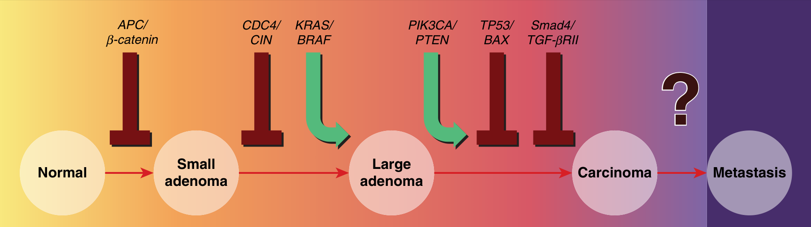
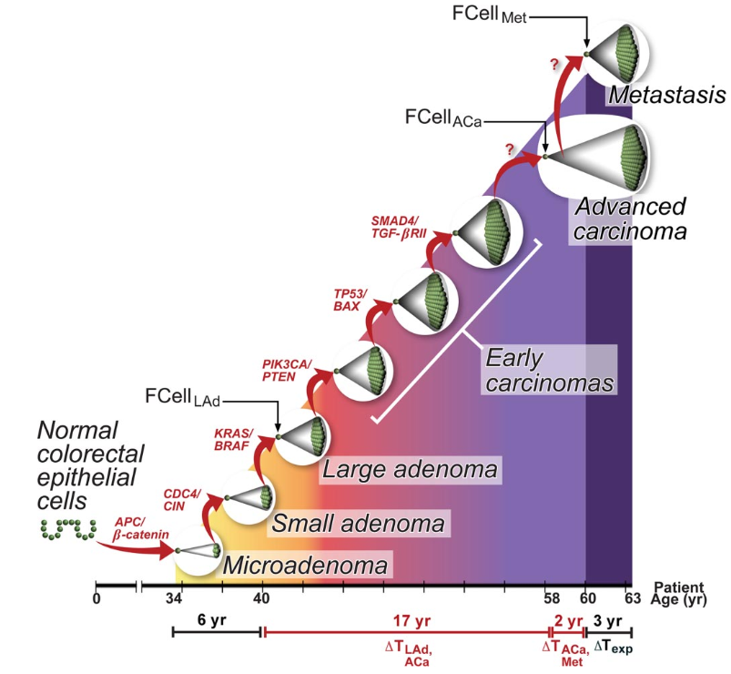

# 178-Inherited Colorectal Cancer and the Genetics of Colorectal Cancer

```{r}
#| echo: false
#| results: asis

slides_iframe(600)
```


<iframe
  src="../presentation/178_genetics_crc_inherited_syndromes2.html"
  width="100%"
  height="600"
  style="border:none;"
  allow="fullscreen"
  allowfullscreen>
</iframe>


```{r}
library(DiagrammeR)

grViz("
digraph inherited_crc {

  graph [layout = dot, rankdir = TB, splines = line, 
         nodesep = 0.12, ranksep = 0.22, bgcolor = transparent, margin = 0]

  node [shape = rect, style = 'filled,rounded', fontname = Helvetica,
        fontsize = 9, margin = '0.03,0.03', height = 0.22, width = 0, 
        penwidth = 0.8, color = '#333333']

  edge [arrowsize = 0.55, penwidth = 0.7, color = '#555555']

  root [label = 'Inherited CRC\\nSyndromes', fillcolor = '#E8F0FE', 
        fontsize = 11, penwidth = 1.3, height = 0.32]

  poly      [label = 'Polyposis', fillcolor = '#D9EAD3', height = 0.26]
  nonpoly   [label = 'Nonpolyposis', fillcolor = '#FCE5CD', height = 0.26]

  fap   [label = 'FAP\\n(APC)', fillcolor = '#CFE2F3']
  map   [label = 'MAP\\n(MUTYH)', fillcolor = '#CFE2F3']
  ppap  [label = 'PPAP\\n(POLD1/POLE)', fillcolor = '#CFE2F3']
  ham   [label = 'Hamartomatous', fillcolor = '#B6D7A8']
  hmps  [label = 'HMPS\\n(GREM1)', fillcolor = '#CFE2F3']

  jps   [label = 'JPS\\n(SMAD4/\\nBMPR1A)', fillcolor = '#D9EAD3']
  pjs   [label = 'PJS\\n(STK11)', fillcolor = '#D9EAD3']
  phts  [label = 'PHTS\\n(PTEN)', fillcolor = '#D9EAD3']

  lynch [label = 'Lynch\\n(MLH1/MSH2/\\nMSH6/PMS2)', fillcolor = '#F9CB9C']
  fccx  [label = 'FCC X', fillcolor = '#F9CB9C']
  cmmrd [label = 'CMMRD\\n(biallelic MMR)', fillcolor = '#F9CB9C']

  root -> poly
  root -> nonpoly
  poly -> {fap map ppap ham hmps}
  nonpoly -> {lynch fccx cmmrd}
  ham -> {jps pjs phts}
}
")
```


```{r}

library(DiagrammeR)

grViz("
digraph inheritance {

  graph [layout = dot, rankdir = TB, splines = line,
         nodesep = 0.10, ranksep = 0.22, bgcolor = transparent, margin = 0]

  node [shape = rect, style = 'filled,rounded', fontname = Helvetica,
        fontsize = 9, margin = '0.03,0.03', height = 0.20, width = 0,
        penwidth = 0.7, color = '#333333']

  edge [arrowsize = 0.50, penwidth = 0.6, color = '#555555']

  root  [label = 'Inherited CRC Polyposis\\nSyndromes', fillcolor = '#E8F0FE',
         fontsize = 11, penwidth = 1.2, height = 0.30]

  dom   [label = 'Autosomal\\nDOMINANT', fillcolor = '#D9EAD3',
         fontsize = 10, penwidth = 1.0, height = 0.24]
  rec   [label = 'Autosomal\\nRECESSIVE', fillcolor = '#F4CCCC',
         fontsize = 10, penwidth = 1.0, height = 0.24]
  unc   [label = 'UNCLEAR', fillcolor = '#FFF2CC',
         fontsize = 10, penwidth = 1.0, height = 0.24]

  fap   [label = 'FAP\\n(APC)', fillcolor = '#CFE2F3']
  ppap  [label = 'PPAP\\n(POLD1/POLE)', fillcolor = '#CFE2F3']
  hmps  [label = 'HMPS\\n(GREM1)', fillcolor = '#CFE2F3']
  phts  [label = 'PHTS\\n(PTEN)', fillcolor = '#CFE2F3']
  jps   [label = 'JPS\\n(SMAD4/\\nBMPR1A)', fillcolor = '#CFE2F3']
  pjs   [label = 'PJS\\n(STK11)', fillcolor = '#CFE2F3']

  map   [label = 'MAP\\n(MUTYH)', fillcolor = '#F4CCCC']
  nthl1 [label = 'NTHL1\\n(NTHL1)', fillcolor = '#F4CCCC']

  sps   [label = 'Serrated Polyposis\\n(RNF43)', fillcolor = '#FFF2CC']

  root -> dom
  root -> rec
  root -> unc

  dom -> {fap ppap hmps phts jps pjs}
  rec -> {map nthl1}
  unc -> sps
}
")
```


```{r}

library(DiagrammeR)

grViz("
digraph inheritance {

  graph [layout = dot, rankdir = TB, splines = line,
         nodesep = 0.10, ranksep = 0.22, bgcolor = transparent, margin = 0]

  node [shape = rect, style = 'filled,rounded', fontname = Helvetica,
        fontsize = 9, margin = '0.03,0.03', height = 0.20, width = 0,
        penwidth = 0.7, color = '#333333']

  edge [arrowsize = 0.50, penwidth = 0.6, color = '#555555']

  root  [label = 'Inherited CRC Polyposis\\nSyndromes', fillcolor = '#E8F0FE',
         fontsize = 11, penwidth = 1.2, height = 0.30]

  dom   [label = 'Autosomal\\nDOMINANT', fillcolor = '#D9EAD3',
         fontsize = 10, penwidth = 1.0, height = 0.24]
  rec   [label = 'Autosomal\\nRECESSIVE', fillcolor = '#F4CCCC',
         fontsize = 10, penwidth = 1.0, height = 0.24]
  unc   [label = 'UNCLEAR', fillcolor = '#FFF2CC',
         fontsize = 10, penwidth = 1.0, height = 0.24]

  fap   [label = 'FAP\\n(APC)', fillcolor = '#CFE2F3']
  ppap  [label = 'PPAP\\n(POLD1/POLE)', fillcolor = '#CFE2F3']
  hmps  [label = 'HMPS\\n(GREM1)', fillcolor = '#CFE2F3']
  phts  [label = 'PHTS\\n(PTEN)', fillcolor = '#CFE2F3']
  jps   [label = 'JPS\\n(SMAD4/\\nBMPR1A)', fillcolor = '#CFE2F3']
  pjs   [label = 'PJS\\n(STK11)', fillcolor = '#CFE2F3']

  map   [label = 'MAP\\n(MUTYH)', fillcolor = '#F4CCCC']
  nthl1 [label = 'NTHL1\\n(NTHL1)', fillcolor = '#F4CCCC']

  sps   [label = 'Serrated Polyposis\\n(RNF43)', fillcolor = '#FFF2CC']

  root -> dom
  root -> rec
  root -> unc

  dom -> {fap ppap hmps phts jps pjs}
  rec -> {map nthl1}
  unc -> sps
}
")
```


Generated with Qwen. 

1. What is the first genetic alteration in the progression from normal colonic epithelium to small adenoma?

- CDC4/CIN
- **APC/β-catenin**
- KRAS/BRAF
- TP53/BAX

*Explanation: "APC/β-catenin alteration is the initiating event in colorectal carcinogenesis, occurring during the transition from normal epithelium to small adenoma."*

2. Which genetic changes are associated with the transition from small adenoma to large adenoma?

- **CDC4/CIN and KRAS/BRAF**
- APC/β-catenin and TP53
- PIK3CA/PTEN and Smad4
- TP53/BAX and TGF-βRII

*Explanation: "The progression from small to large adenoma involves CDC4/CIN loss and KRAS/BRAF activation."*

3. What type of genetic alteration is represented by the downward arrow (↓) in the diagram?

- Gene activation
- **Gene inactivation/loss**
- Gene amplification
- Gene translocation

*Explanation: "Downward arrows (↓) in the diagram represent gene inactivation or loss of tumor suppressor genes."*

4. What type of genetic alteration is represented by the curved arrow (↱) in the diagram?

- Gene deletion
- Gene silencing
- **Gene activation**
- Gene mutation

*Explanation: "Curved arrows (↱) in the diagram represent oncogene activation."*


{width=70% fig-align="center"}

::: {.callout-note}
The process is initiated when a single colorectal epithelial cell
acquires a mutation in a gene inactivating the APC/beta-catenin
pathway. Mutations that constitutively activate the KRAS/BRAF
pathway are associated with the growth of a small adenoma to
clinically significant size (>1 cm in diameter). Subsequent waves
of clonal expansion driven by mutations in genes controlling the
TGF-beta, PIK3CA, TP53, and other pathways are
responsible for the transition from a benign tumor (adenoma) to a
malignant tumor (carcinoma).

:::

5. Which stage follows large adenoma in the colorectal cancer progression sequence?

- Small adenoma
- **Carcinoma**
- Metastasis
- Normal epithelium

*Explanation: "The sequence progresses as: Normal → Small adenoma → Large adenoma → Carcinoma → Metastasis."*

6. What genetic alterations occur during the transition from large adenoma to carcinoma?

- APC/β-catenin and CDC4
- **PIK3CA/PTEN, TP53/BAX, and Smad4/TGF-βRII**
- KRAS/BRAF only
- CDC4/CIN only

*Explanation: "The transition to carcinoma involves multiple genetic alterations including PIK3CA/PTEN activation, TP53/BAX loss, and Smad4/TGF-βRII loss."*

7. What does the question mark (?) between carcinoma and metastasis indicate?

- Known genetic changes
- **Unknown or additional genetic changes**
- No genetic changes required
- Reversal of mutations

*Explanation: "The question mark indicates that the specific genetic changes required for metastasis are not fully characterized or may involve additional alterations."*

8. Which gene family is altered first in colorectal carcinogenesis?

- KRAS
- TP53
- **APC**
- BRAF

*Explanation: "APC mutation is the earliest and most common initiating event in colorectal cancer development."*

9. What is the role of APC gene in normal cells?

- Oncogene activation
- **Tumor suppressor**
- DNA repair enzyme
- Growth factor

*Explanation: "APC is a tumor suppressor gene that regulates β-catenin degradation in the Wnt signaling pathway."*

10. Which pathway is primarily affected by APC/β-catenin alterations?

- PI3K/AKT pathway
- **Wnt signaling pathway**
- TGF-β pathway
- MAPK pathway

*Explanation: "APC regulates the Wnt signaling pathway by controlling β-catenin levels."*

{width=70% fig-align="center"}


11. What type of gene is KRAS?

- Tumor suppressor
- **Oncogene**
- DNA repair gene
- Apoptosis gene

*Explanation: "KRAS is an oncogene that when mutated, promotes cell proliferation and survival."*

12. During which transition does KRAS/BRAF activation occur?

- Normal to small adenoma
- **Small adenoma to large adenoma**
- Large adenoma to carcinoma
- Carcinoma to metastasis

*Explanation: "KRAS/BRAF activation occurs during the progression from small to large adenoma."*

13. What is the function of TP53 in normal cells?

- Promotes cell division
- **Tumor suppressor and apoptosis regulator**
- Activates Wnt signaling
- Promotes angiogenesis

*Explanation: "TP53 is a critical tumor suppressor that regulates cell cycle arrest and apoptosis."*

14. Which genetic alteration is associated with chromosomal instability (CIN)?

- APC mutation
- **CDC4 mutation**
- KRAS mutation
- BRAF mutation

*Explanation: "CDC4 mutations are associated with chromosomal instability in colorectal cancer."*

15. What does PTEN normally function as?

- Oncogene
- **Tumor suppressor**
- Growth factor receptor
- Transcription factor

*Explanation: "PTEN is a tumor suppressor that negatively regulates the PI3K/AKT signaling pathway."*

16. Which pathway is affected by PIK3CA/PTEN alterations?

- Wnt pathway
- **PI3K/AKT pathway**
- TGF-β pathway
- Notch pathway

*Explanation: "PIK3CA and PTEN are key regulators of the PI3K/AKT signaling pathway."*

17. What is the role of Smad4 in cellular signaling?

- Wnt pathway activator
- **TGF-β pathway mediator**
- PI3K pathway inhibitor
- MAPK pathway activator

*Explanation: "Smad4 is a critical mediator of TGF-β signaling pathway."*

18. Which genetic change occurs latest in the adenoma-carcinoma sequence before metastasis?

- APC/β-catenin
- KRAS/BRAF
- **TP53/BAX and Smad4/TGF-βRII**
- CDC4/CIN

*Explanation: "TP53/BAX and Smad4/TGF-βRII alterations occur during the transition from large adenoma to carcinoma, representing late events before metastasis."*

19. What does BAX protein normally promote?

- Cell proliferation
- **Apoptosis**
- Cell migration
- Angiogenesis

*Explanation: "BAX is a pro-apoptotic protein that promotes programmed cell death."*

20. Which alteration is considered an early event in colorectal carcinogenesis?

- TP53 mutation
- **APC mutation**
- Smad4 loss
- PIK3CA activation

*Explanation: "APC mutation is the earliest detectable genetic alteration in colorectal cancer development."*

21. How many major stages are shown in the colorectal cancer progression model?

- 3
- 4
- **5**
- 6

*Explanation: "The model shows 5 stages: Normal, Small adenoma, Large adenoma, Carcinoma, and Metastasis."*

22. Which genetic alterations involve tumor suppressor gene loss?

- KRAS/BRAF and PIK3CA
- **APC/β-catenin, CDC4/CIN, TP53/BAX, and Smad4/TGF-βRII**
- Only KRAS/BRAF
- Only PIK3CA/PTEN

*Explanation: "APC, CDC4, TP53, BAX, Smad4, TGF-βRII, and PTEN are tumor suppressor genes that are lost or inactivated during progression."*

23. Which genetic alterations involve oncogene activation?

- APC and TP53
- **KRAS/BRAF and PIK3CA**
- CDC4 and Smad4
- BAX and PTEN

*Explanation: "KRAS, BRAF, and PIK3CA are oncogenes that are activated during colorectal cancer progression."*

24. What is the significance of the multistep progression model?

- Cancer develops rapidly
- **Cancer develops through accumulation of genetic alterations**
- Only one mutation is needed
- Metastasis occurs immediately

*Explanation: "The model demonstrates that colorectal cancer develops through sequential accumulation of multiple genetic alterations."*

25. Which transition involves the most genetic alterations?

- Normal to small adenoma
- Small adenoma to large adenoma
- **Large adenoma to carcinoma**
- Carcinoma to metastasis

*Explanation: "The transition from large adenoma to carcinoma involves three major genetic alterations: PIK3CA/PTEN, TP53/BAX, and Smad4/TGF-βRII."*

26. What does CIN stand for in the context of colorectal cancer?

- Cellular Integration Network
- **Chromosomal Instability**
- Cancer Initiation Node
- Cell Invasion Network

*Explanation: "CIN stands for Chromosomal Instability, which is associated with CDC4 alterations."*

27. Which gene is part of the ubiquitin ligase complex?

- APC
- **CDC4**
- KRAS
- TP53

*Explanation: "CDC4/FBXW7 is part of a ubiquitin ligase complex that targets proteins for degradation."*

28. What is the clinical significance of understanding the adenoma-carcinoma sequence?

- No clinical significance
- **Early detection and prevention through polyp removal**
- Only useful for research
- Only applicable to metastatic disease

*Explanation: "Understanding this sequence allows for early detection and prevention through screening and removal of adenomatous polyps."*

29. Which alteration is most commonly found in colorectal cancers?

- KRAS mutation
- **APC mutation**
- TP53 mutation
- BRAF mutation

*Explanation: "APC mutations are found in approximately 80% of sporadic colorectal cancers."*

30. What is the typical timeframe for progression from adenoma to carcinoma?

- Weeks to months
- **Years to decades**
- Days to weeks
- Months to a year

*Explanation: "The progression from adenoma to carcinoma typically takes 10-15 years, allowing time for screening and intervention."*

31. Which pathway regulates cell growth and proliferation through β-catenin?

- PI3K pathway
- **Wnt pathway**
- TGF-β pathway
- JAK-STAT pathway

*Explanation: "The Wnt signaling pathway regulates cell growth and proliferation through β-catenin stabilization."*

32. What happens to β-catenin when APC is functional?

- It accumulates in the nucleus
- **It is degraded**
- It activates transcription
- It promotes cell division

*Explanation: "Functional APC promotes β-catenin degradation, preventing its nuclear accumulation and transcriptional activity."*

33. Which mutation allows cells to evade apoptosis?

- APC mutation
- **TP53/BAX loss**
- KRAS activation
- CDC4 loss

*Explanation: "Loss of TP53 and BAX impairs the cell's ability to undergo apoptosis in response to DNA damage."*

34. What is the role of TGF-β signaling in normal epithelial cells?

- Promotes proliferation
- **Inhibits cell growth**
- Activates Wnt signaling
- Promotes angiogenesis

*Explanation: "TGF-β signaling normally acts as a growth inhibitor in epithelial cells."*

35. Which genetic alteration disrupts TGF-β signaling?

- APC mutation
- KRAS activation
- **Smad4/TGF-βRII loss**
- PIK3CA activation

*Explanation: "Loss of Smad4 or TGF-βRII disrupts TGF-β signaling, removing growth inhibitory signals."*

36. What does the activation of PIK3CA promote?

- Apoptosis
- **Cell survival and growth**
- Cell cycle arrest
- DNA repair

*Explanation: "PIK3CA activation promotes cell survival and growth through the PI3K/AKT pathway."*

37. Which stage is considered premalignant?

- Carcinoma
- Metastasis
- **Adenoma (small and large)**
- Normal epithelium

*Explanation: "Adenomas (both small and large) are considered premalignant lesions that can progress to carcinoma."*

38. What is the significance of BRAF mutation in colorectal cancer?

- Early event like APC
- **Alternative to KRAS activation**
- Only found in metastasis
- Prevents adenoma formation

*Explanation: "BRAF mutations often occur as an alternative to KRAS mutations in the MAPK pathway activation."*

39. Which pathway is involved in both small to large adenoma and large adenoma to carcinoma transitions?

- Wnt pathway only
- **MAPK pathway (KRAS/BRAF)**
- TGF-β pathway only
- Only PI3K pathway

*Explanation: "The MAPK pathway through KRAS/BRAF is activated during the small to large adenoma transition and continues to play a role in progression."*

40. What is the clinical implication of the question mark before metastasis?

- Metastasis is not important
- **Additional research is needed to understand metastatic mechanisms**
- No genetic changes occur
- Metastasis is reversible

*Explanation: "The question mark indicates that the complete genetic and molecular mechanisms underlying metastasis are not fully understood and require further research."*

41. Which genetic alteration is associated with the transition from benign to malignant?

- APC mutation
- KRAS activation
- **TP53 loss**
- CDC4 loss

*Explanation: "TP53 loss is a critical event in the transition from benign adenoma to malignant carcinoma."*

42. What percentage of colorectal cancers follow the adenoma-carcinoma sequence?

- 10-20%
- 40-50%
- **70-80%**
- 95-100%

*Explanation: "Approximately 70-80% of colorectal cancers develop through the classical adenoma-carcinoma sequence."*

43. Which gene is located on chromosome 17?

- APC
- KRAS
- **TP53**
- BRAF

*Explanation: "TP53 is located on chromosome 17p13.1."*

44. What is the function of PTEN?

- Activates PI3K
- **Dephosphorylates PIP3 to PIP2**
- Phosphorylates proteins
- Activates mTOR

*Explanation: "PTEN is a phosphatase that dephosphorylates PIP3 to PIP2, negatively regulating the PI3K/AKT pathway."*

45. Which alteration leads to constitutive activation of Wnt signaling?

- TP53 mutation
- **APC mutation**
- KRAS mutation
- Smad4 loss

*Explanation: "APC mutation leads to β-catenin accumulation and constitutive activation of Wnt signaling."*

46. What is the role of CDC4 in cell cycle regulation?

- Promotes cell division
- **Targets cyclin E for degradation**
- Activates Wnt signaling
- Inhibits apoptosis

*Explanation: "CDC4/FBXW7 targets cyclin E and other oncoproteins for ubiquitin-mediated degradation."*

47. Which genetic change is associated with genomic instability?

- APC mutation
- **CDC4 mutation**
- KRAS mutation
- PIK3CA mutation

*Explanation: "CDC4 mutations are associated with chromosomal instability (CIN) in colorectal cancer."*

48. What does the accumulation of genetic alterations lead to?

- Normal cell function
- **Progressive transformation to cancer**
- Cell differentiation
- Tissue regeneration

*Explanation: "The stepwise accumulation of genetic alterations drives progressive transformation from normal epithelium to carcinoma."*

49. Which pathway is commonly altered in the transition to carcinoma?

- Wnt pathway
- **PI3K/AKT and TGF-β pathways**
- Only Wnt pathway
- Notch pathway

*Explanation: "The transition to carcinoma involves alterations in PI3K/AKT (PIK3CA/PTEN) and TGF-β (Smad4/TGF-βRII) pathways."*

50. What is the significance of identifying the genetic sequence in colorectal cancer?

- No significance
- **Development of targeted therapies and screening strategies**
- Only useful for diagnosis
- Only useful for prognosis

*Explanation: "Understanding the genetic sequence enables development of targeted therapies and informs screening and prevention strategies."*

51. Which gene mutation is found in familial adenomatous polyposis (FAP)?

- KRAS
- TP53
- **APC**
- BRAF

*Explanation: "Germline mutations in APC cause familial adenomatous polyposis (FAP)."*

52. What is the normal function of β-catenin in cell adhesion?

- Degrades cell junctions
- **Participates in cell-cell adhesion**
- Promotes cell migration
- Inhibits adhesion

*Explanation: "β-catenin participates in cell-cell adhesion by linking cadherins to the actin cytoskeleton."*

53. Which alteration promotes angiogenesis?

- APC mutation
- **TP53 loss**
- CDC4 loss
- All alterations contribute

*Explanation: "TP53 loss and other alterations contribute to angiogenesis through various mechanisms including VEGF upregulation."*

54. What is the role of the MAPK pathway in colorectal cancer?

- Inhibits cell growth
- **Promotes cell proliferation**
- Induces apoptosis
- Suppresses tumor growth

*Explanation: "The MAPK pathway, activated by KRAS/BRAF mutations, promotes cell proliferation and survival."*

55. Which genetic alteration occurs in approximately 50% of colorectal cancers?

- APC mutation
- **TP53 mutation**
- KRAS mutation
- BRAF mutation

*Explanation: "TP53 mutations occur in approximately 50-70% of colorectal cancers."*

56. What does the term "adenoma" refer to?

- Malignant tumor
- **Benign glandular tumor**
- Metastatic lesion
- Normal tissue

*Explanation: "Adenoma refers to a benign glandular tumor that can progress to adenocarcinoma."*

57. Which pathway alteration is associated with resistance to EGFR inhibitors?

- APC mutation
- **KRAS/BRAF mutation**
- TP53 mutation
- CDC4 mutation

*Explanation: "KRAS and BRAF mutations confer resistance to EGFR-targeted therapies in colorectal cancer."*

58. What is the significance of PTEN loss in colorectal cancer?

- Activates apoptosis
- **Activates PI3K/AKT signaling**
- Inhibits cell growth
- Promotes differentiation

*Explanation: "PTEN loss leads to constitutive activation of the PI3K/AKT pathway, promoting cell survival and growth."*

59. Which genetic change is associated with the transition from intramucosal to invasive carcinoma?

- APC mutation
- **TP53 mutation**
- KRAS mutation
- CDC4 mutation

*Explanation: "TP53 mutation is critical for the transition from intramucosal to invasive carcinoma."*

60. What is the role of Smad4 in TGF-β signaling?

- Inhibits TGF-β signaling
- **Mediates TGF-β signal transduction**
- Degrades TGF-β receptors
- Activates Wnt signaling

*Explanation: "Smad4 is a common mediator Smad that is essential for TGF-β signal transduction."*

61. Which alteration is considered a gatekeeper mutation?

- KRAS
- **APC**
- TP53
- BRAF

*Explanation: "APC is considered a gatekeeper mutation because it initiates the adenoma formation process."*

62. What happens when both alleles of a tumor suppressor gene are lost?

- No effect
- **Complete loss of tumor suppressor function**
- Activation of the gene
- Partial function maintained

*Explanation: "Loss of both alleles (following the two-hit hypothesis) results in complete loss of tumor suppressor function."*

63. Which pathway is involved in cell cycle progression?

- TGF-β pathway
- **Wnt and PI3K pathways**
- Only TGF-β pathway
- Apoptosis pathway

*Explanation: "Wnt and PI3K pathways promote cell cycle progression and proliferation."*

64. What is the clinical significance of detecting APC mutations?

- No significance
- **Early detection and risk stratification**
- Only useful in metastatic disease
- Only useful for treatment

*Explanation: "APC mutation detection is significant for early detection, risk stratification, and understanding disease progression."*

65. Which genetic alteration promotes epithelial-mesenchymal transition (EMT)?

- APC mutation
- **TGF-β pathway alterations**
- KRAS mutation
- CDC4 mutation

*Explanation: "TGF-β pathway alterations, including Smad4 loss, can promote EMT and metastasis."*

66. What is the function of BAX in apoptosis?

- Inhibits apoptosis
- **Promotes mitochondrial outer membrane permeabilization**
- Activates cell proliferation
- Promotes DNA repair

*Explanation: "BAX promotes apoptosis by permeabilizing the mitochondrial outer membrane, releasing cytochrome c."*

67. Which alteration is associated with microsatellite instability (MSI)?

- APC mutation
- **Not typically associated with this pathway**
- KRAS mutation
- TP53 mutation

*Explanation: "The adenoma-carcinoma sequence shown is associated with chromosomal instability (CIN), not microsatellite instability (MSI)."*

68. What is the significance of the multistep model for screening?

- No significance
- **Provides window of opportunity for early detection**
- Only useful for treatment
- Only useful for research

*Explanation: "The multistep progression provides a window of opportunity for screening and early detection before malignancy develops."*

69. Which gene is mutated in Li-Fraumeni syndrome?

- APC
- **TP53**
- KRAS
- BRAF

*Explanation: "Germline TP53 mutations cause Li-Fraumeni syndrome, a cancer predisposition syndrome."*

70. What does the activation of oncogenes lead to?

- Growth inhibition
- **Uncontrolled cell proliferation**
- Apoptosis
- Cell differentiation

*Explanation: "Oncogene activation (KRAS, BRAF, PIK3CA) leads to uncontrolled cell proliferation and survival."*

71. Which pathway alteration is targetable with current therapies?

- APC mutation
- **PIK3CA mutation**
- TP53 mutation
- CDC4 mutation

*Explanation: "PIK3CA mutations are potentially targetable with PI3K inhibitors, though clinical efficacy is still being evaluated."*

72. What is the role of chromosomal instability in cancer progression?

- Prevents cancer
- **Promotes genetic diversity and evolution**
- Induces apoptosis
- Promotes differentiation

*Explanation: "Chromosomal instability promotes genetic diversity, allowing selection of advantageous mutations during cancer evolution."*

73. Which alteration is associated with poor prognosis?

- APC mutation alone
- **Multiple alterations including TP53 loss**
- Early adenoma
- Single mutation

*Explanation: "Accumulation of multiple genetic alterations, particularly TP53 loss, is associated with poor prognosis."*

74. What is the significance of understanding the order of genetic events?

- No significance
- **Helps understand tumor biology and develop interventions**
- Only useful for classification
- Only useful for research

*Explanation: "Understanding the temporal sequence of genetic events helps elucidate tumor biology and identify points for intervention."*

75. Which pathway is involved in maintaining genomic stability?

- Wnt pathway
- **TP53 pathway**
- PI3K pathway
- MAPK pathway

*Explanation: "TP53 plays a crucial role in maintaining genomic stability through DNA repair and cell cycle checkpoint control."*

76. What happens when TGF-β signaling is lost?

- Growth inhibition
- **Loss of growth inhibition and promotion of metastasis**
- Apoptosis
- Differentiation

*Explanation: "Loss of TGF-β signaling removes growth inhibitory signals and can promote metastasis through EMT."*

77. Which genetic alteration is most common in small adenomas?

- TP53 mutation
- **APC mutation**
- Smad4 loss
- PIK3CA activation

*Explanation: "APC mutation is the most common and earliest alteration, present in most small adenomas."*

78. What is the role of the PI3K/AKT pathway in cancer?

- Induces apoptosis
- **Promotes cell survival and growth**
- Inhibits proliferation
- Promotes differentiation

*Explanation: "The PI3K/AKT pathway promotes cell survival, growth, and metabolism in cancer cells."*

79. Which alteration is associated with the transition to large adenoma?

- Only APC mutation
- **KRAS/BRAF activation**
- TP53 mutation
- Smad4 loss

*Explanation: "KRAS or BRAF activation drives the progression from small to large adenoma."*

80. What is the clinical implication of the adenoma-carcinoma sequence for prevention?

- No prevention possible
- **Polypectomy can prevent cancer**
- Only chemotherapy works
- Only radiation works

*Explanation: "Removal of adenomatous polyps (polypectomy) can prevent progression to carcinoma."*

81. Which gene is part of the Wnt signaling pathway?

- KRAS
- **APC and β-catenin**
- TP53
- BRAF

*Explanation: "APC and β-catenin are core components of the Wnt signaling pathway."*

82. What does the loss of tumor suppressor genes lead to?

- Growth inhibition
- **Uncontrolled cell growth**
- Apoptosis
- Differentiation

*Explanation: "Loss of tumor suppressor genes removes growth inhibitory controls, leading to uncontrolled cell growth."*

83. Which pathway is involved in the response to DNA damage?

- Wnt pathway
- **TP53 pathway**
- PI3K pathway
- MAPK pathway

*Explanation: "TP53 pathway is activated in response to DNA damage, leading to cell cycle arrest or apoptosis."*

84. What is the significance of BRAF V600E mutation?

- No significance
- **Associated with specific clinical and molecular features**
- Only found in small adenomas
- Prevents cancer

*Explanation: "BRAF V600E mutation is associated with specific clinical features including MSI-high and poor prognosis in some contexts."*

85. Which alteration is necessary but not sufficient for cancer development?

- Single APC mutation
- **Multiple genetic alterations**
- Only TP53 mutation
- Only KRAS mutation

*Explanation: "Multiple genetic alterations are necessary for cancer development; single mutations are typically not sufficient."*

86. What is the role of CDC4 in protein degradation?

- Prevents degradation
- **Targets proteins for ubiquitin-mediated degradation**
- Degrades DNA
- Degrades RNA

*Explanation: "CDC4/FBXW7 is part of an E3 ubiquitin ligase complex that targets oncoproteins for degradation."*

87. Which pathway alteration promotes metabolic reprogramming?

- Wnt pathway
- **PI3K/AKT pathway**
- TGF-β pathway
- Notch pathway

*Explanation: "PI3K/AKT pathway activation promotes metabolic reprogramming including increased glucose uptake and glycolysis."*

88. What is the significance of the question mark before metastasis?

- Metastasis is unimportant
- **Complex and incompletely understood process**
- No genetic changes needed
- Reversible process

*Explanation: "Metastasis involves complex genetic and epigenetic changes that are not fully characterized."*

89. Which alteration is associated with increased cell motility?

- APC mutation
- **TGF-β pathway alterations**
- CDC4 loss
- All alterations

*Explanation: "TGF-β pathway alterations, particularly Smad4 loss, can promote cell motility and invasion through EMT."*

90. What is the role of β-catenin in transcription?

- Represses transcription
- **Activates transcription of target genes**
- Degrades DNA
- Inhibits RNA polymerase

*Explanation: "Nuclear β-catenin acts as a transcriptional co-activator for TCF/LEF transcription factors."*

91. Which genetic change is associated with evasion of immune surveillance?

- APC mutation
- **Multiple alterations including TP53 loss**
- Only KRAS mutation
- Only CDC4 loss

*Explanation: "Multiple genetic alterations contribute to evasion of immune surveillance through various mechanisms."*

92. What is the significance of understanding driver versus passenger mutations?

- No significance
- **Identifies therapeutic targets**
- Only useful for classification
- Only useful for research

*Explanation: "Distinguishing driver from passenger mutations helps identify actionable therapeutic targets."*

93. Which pathway is involved in stem cell maintenance?

- TGF-β pathway
- **Wnt pathway**
- Only TGF-β pathway
- Apoptosis pathway

*Explanation: "Wnt signaling is crucial for maintaining intestinal stem cells."*

94. What happens when PTEN is lost?

- Decreased AKT signaling
- **Increased AKT signaling**
- Decreased cell growth
- Increased apoptosis

*Explanation: "PTEN loss leads to increased PIP3 levels and constitutive AKT activation."*

95. Which alteration is associated with resistance to chemotherapy?

- APC mutation
- **TP53 mutation**
- CDC4 loss
- All alterations

*Explanation: "TP53 mutation is associated with resistance to chemotherapy due to impaired apoptosis."*

96. What is the role of TGF-βRII in signaling?

- Inhibits TGF-β
- **Receptor for TGF-β ligands**
- Degrades Smad4
- Activates Wnt

*Explanation: "TGF-βRII is a transmembrane receptor that binds TGF-β ligands and initiates signaling."*

97. Which genetic alteration promotes angiogenesis?

- APC mutation
- **TP53 loss and others**
- CDC4 loss
- Only KRAS mutation

*Explanation: "Multiple alterations including TP53 loss promote angiogenesis through VEGF and other factors."*

98. What is the significance of the sequential model for drug development?

- No significance
- **Identifies stage-specific therapeutic opportunities**
- Only useful for diagnosis
- Only useful for prognosis

*Explanation: "The sequential model helps identify stage-specific therapeutic targets and prevention strategies."*

99. Which pathway is involved in cell adhesion?

- PI3K pathway
- **Wnt pathway (through β-catenin)**
- Only PI3K pathway
- MAPK pathway

*Explanation: "β-catenin participates in cell-cell adhesion through E-cadherin complexes."*

100. What is the role of genetic instability in cancer evolution?

- Prevents evolution
- **Accelerates acquisition of advantageous mutations**
- Induces apoptosis
- Promotes differentiation

*Explanation: "Genetic instability accelerates the acquisition of mutations that confer growth advantages."*

101. Which alteration is found in the majority of colorectal cancers?

- KRAS mutation
- **APC mutation**
- BRAF mutation
- PIK3CA mutation

*Explanation: "APC mutations are found in approximately 80% of sporadic colorectal cancers."*

102. What is the significance of the adenoma stage for screening?

- No significance
- **Detectable and removable premalignant lesion**
- Only visible microscopically
- Cannot be detected

*Explanation: "Adenomas are detectable by colonoscopy and removable, preventing progression to cancer."*

103. Which pathway alteration is associated with inflammation?

- Wnt pathway
- **NF-κB and others**
- Only Wnt pathway
- TGF-β pathway

*Explanation: "Multiple pathways including NF-κB are involved in inflammation-associated colorectal cancer."*

104. What is the role of KRAS in signal transduction?

- Inhibits signaling
- **Transduces growth signals**
- Degrades proteins
- Inhibits transcription

*Explanation: "KRAS is a GTPase that transduces growth signals from cell surface receptors to downstream effectors."*

105. Which alteration is associated with the CpG island methylator phenotype (CIMP)?

- APC mutation
- **BRAF mutation**
- TP53 mutation
- CDC4 loss

*Explanation: "BRAF mutations are strongly associated with the CIMP-high phenotype in colorectal cancer."*

106. What is the significance of understanding molecular subtypes?

- No significance
- **Guides personalized treatment**
- Only useful for research
- Only useful for classification

*Explanation: "Molecular subtyping helps guide personalized treatment decisions and prognosis."*

107. Which pathway is involved in DNA repair?

- Wnt pathway
- **TP53 pathway**
- PI3K pathway
- MAPK pathway

*Explanation: "TP53 pathway is involved in DNA damage response and repair mechanisms."*

108. What happens when Smad4 is lost?

- Enhanced TGF-β signaling
- **Loss of TGF-β signaling**
- Increased apoptosis
- Decreased proliferation

*Explanation: "Smad4 loss disrupts TGF-β signaling, removing growth inhibitory signals."*

109. Which alteration promotes invasion?

- APC mutation
- **Multiple alterations including TGF-β pathway changes**
- Only KRAS mutation
- Only CDC4 loss

*Explanation: "Multiple alterations contribute to invasion through various mechanisms including EMT and matrix degradation."*

110. What is the role of the microenvironment in progression?

- No role
- **Supports tumor growth and progression**
- Prevents progression
- Only important in metastasis

*Explanation: "The tumor microenvironment plays a crucial role in supporting tumor growth, invasion, and metastasis."*

111. Which genetic alteration is associated with synchronous lesions?

- APC mutation
- **Multiple alterations**
- Only KRAS mutation
- Only TP53 mutation

*Explanation: "Multiple genetic alterations and field cancerization contribute to synchronous lesion development."*

112. What is the significance of clonal evolution?

- No significance
- **Explains tumor heterogeneity and progression**
- Only important in metastasis
- Only important in treatment

*Explanation: "Clonal evolution explains how tumors acquire heterogeneity and progress through selection of advantageous mutations."*

113. Which pathway is involved in autophagy?

- Wnt pathway
- **PI3K/AKT/mTOR pathway**
- Only Wnt pathway
- TGF-β pathway

*Explanation: "The PI3K/AKT/mTOR pathway regulates autophagy, which can promote tumor survival."*

114. What is the role of epigenetic changes in progression?

- No role
- **Contribute to gene silencing and activation**
- Only important in metastasis
- Prevent progression

*Explanation: "Epigenetic changes including DNA methylation and histone modification contribute to gene silencing and activation during progression."*

115. Which alteration is associated with right-sided tumors?

- APC mutation
- **BRAF mutation and MSI**
- TP53 mutation
- KRAS mutation

*Explanation: "BRAF mutations and MSI are more common in right-sided colorectal cancers."*

116. What is the significance of tumor budding?

- No significance
- **Associated with poor prognosis and metastasis**
- Only important in early stage
- Prevents metastasis

*Explanation: "Tumor budding is associated with poor prognosis, invasion, and metastasis."*

117. Which pathway is involved in senescence?

- Wnt pathway
- **TP53 and Rb pathways**
- Only Wnt pathway
- PI3K pathway

*Explanation: "TP53 and Rb pathways are involved in inducing cellular senescence as a tumor suppressive mechanism."*

118. What is the role of cancer stem cells?

- No role
- **Drive tumor initiation and recurrence**
- Only important in metastasis
- Prevent tumor growth

*Explanation: "Cancer stem cells are thought to drive tumor initiation, progression, and recurrence."*

119. Which alteration is associated with mucinous histology?

- APC mutation
- **MSI and BRAF mutation**
- TP53 mutation
- KRAS mutation

*Explanation: "Mucinous histology is associated with MSI-high and BRAF mutations."*

120. What is the significance of consensus molecular subtypes (CMS)?

- No significance
- **Classifies tumors based on molecular features**
- Only useful for research
- Only useful for early stage

*Explanation: "CMS classification divides colorectal cancers into distinct molecular subtypes with different prognoses and treatment responses."*

121. Which pathway is involved in oxidative stress response?

- Wnt pathway
- **Multiple pathways including PI3K**
- Only Wnt pathway
- TGF-β pathway

*Explanation: "Multiple pathways including PI3K/AKT and Nrf2 are involved in oxidative stress response."*

122. What is the role of the immune system in progression?

- No role
- **Can suppress or promote tumor growth**
- Only suppresses tumors
- Only promotes tumors

*Explanation: "The immune system can both suppress tumor growth through immune surveillance and promote it through inflammation."*

123. Which alteration is associated with signet ring cell carcinoma?

- APC mutation
- **MSI and TGF-β pathway alterations**
- TP53 mutation
- KRAS mutation

*Explanation: "Signet ring cell carcinoma is associated with MSI and TGF-β pathway alterations."*

124. What is the significance of circulating tumor DNA (ctDNA)?

- No significance
- **Detects minimal residual disease and recurrence**
- Only useful for diagnosis
- Only useful for early stage

*Explanation: "ctDNA can detect minimal residual disease, monitor treatment response, and predict recurrence."*

125. Which pathway is involved in hypoxia response?

- Wnt pathway
- **HIF pathway**
- Only Wnt pathway
- TGF-β pathway

*Explanation: "The HIF pathway mediates cellular response to hypoxia, promoting angiogenesis and metabolic adaptation."*

126. What is the role of the microbiome in progression?

- No role
- **Can influence inflammation and carcinogenesis**
- Only prevents cancer
- Only promotes cancer

*Explanation: "The gut microbiome can influence colorectal carcinogenesis through inflammation, metabolite production, and immune modulation."*

127. Which alteration is associated with perineural invasion?

- APC mutation
- **Multiple alterations including TGF-β changes**
- Only KRAS mutation
- Only TP53 mutation

*Explanation: "Multiple genetic alterations contribute to perineural invasion through various mechanisms."*

128. What is the significance of tumor-infiltrating lymphocytes (TILs)?

- No significance
- **Associated with prognosis and treatment response**
- Only important in early stage
- Only important in metastasis

*Explanation: "TIL density is associated with prognosis and response to immunotherapy, particularly in MSI-high tumors."*

129. Which pathway is involved in ferroptosis?

- Wnt pathway
- **Multiple pathways including p53**
- Only Wnt pathway
- TGF-β pathway

*Explanation: "Multiple pathways including p53 and GPX4 regulate ferroptosis, an iron-dependent form of cell death."*

130. What is the role of exosomes in progression?

- No role
- **Mediate intercellular communication and metastasis**
- Only prevent metastasis
- Only important in early stage

*Explanation: "Exosomes mediate intercellular communication, promoting tumor growth, invasion, and metastasis."*

131. Which alteration is associated with lymphovascular invasion?

- APC mutation
- **Multiple alterations including TP53 loss**
- Only KRAS mutation
- Only CDC4 loss

*Explanation: "Multiple genetic alterations contribute to lymphovascular invasion."*

132. What is the significance of tumor grade?

- No significance
- **Correlates with aggressiveness and prognosis**
- Only important in early stage
- Only important in metastasis

*Explanation: "Tumor grade correlates with aggressiveness, metastatic potential, and prognosis."*

133. Which pathway is involved in anoikis resistance?

- Wnt pathway
- **PI3K/AKT and others**
- Only Wnt pathway
- TGF-β pathway

*Explanation: "PI3K/AKT and other pathways promote resistance to anoikis, allowing survival of detached cells."*

134. What is the role of matrix metalloproteinases (MMPs)?

- No role
- **Degrade extracellular matrix and promote invasion**
- Prevent invasion
- Only important in early stage

*Explanation: "MMPs degrade extracellular matrix components, facilitating tumor invasion and metastasis."*

135. Which alteration is associated with chemotherapy resistance?

- APC mutation
- **TP53 mutation and others**
- Only KRAS mutation
- Only CDC4 loss

*Explanation: "Multiple alterations including TP53 mutation contribute to chemotherapy resistance."*

136. What is the significance of margin status?

- No significance
- **Predicts local recurrence and survival**
- Only important in early stage
- Only important in metastasis

*Explanation: "Positive margins predict local recurrence and worse survival outcomes."*

137. Which pathway is involved in glutamine metabolism?

- Wnt pathway
- **Multiple pathways including MYC**
- Only Wnt pathway
- TGF-β pathway

*Explanation: "Multiple pathways including MYC and mTOR regulate glutamine metabolism in cancer cells."*

138. What is the role of cancer-associated fibroblasts (CAFs)?

- No role
- **Support tumor growth and invasion**
- Prevent tumor growth
- Only important in early stage

*Explanation: "CAFs support tumor growth, invasion, and metastasis through various mechanisms."*

139. Which alteration is associated with targeted therapy resistance?

- APC mutation
- **KRAS/BRAF mutation for EGFR inhibitors**
- Only TP53 mutation
- Only CDC4 loss

*Explanation: "KRAS and BRAF mutations confer resistance to EGFR-targeted therapies."*

140. What is the significance of nodal status?

- No significance
- **Major prognostic factor**
- Only important in early stage
- Only important in metastasis

*Explanation: "Nodal status is a major prognostic factor and guides adjuvant therapy decisions."*

141. Which pathway is involved in lipid metabolism?

- Wnt pathway
- **PI3K/AKT/mTOR and others**
- Only Wnt pathway
- TGF-β pathway

*Explanation: "PI3K/AKT/mTOR and other pathways regulate lipid metabolism in cancer cells."*

142. What is the role of tumor-associated macrophages (TAMs)?

- No role
- **Can promote or suppress tumor growth**
- Only suppress tumors
- Only promote tumors

*Explanation: "TAMs can have both pro-tumor and anti-tumor effects depending on their polarization."*

143. Which alteration is associated with immunotherapy response?

- APC mutation
- **MSI-high/dMMR status**
- TP53 mutation
- KRAS mutation

*Explanation: "MSI-high/dMMR tumors respond better to immune checkpoint inhibitors."*

144. What is the significance of performance status?

- No significance
- **Predicts treatment tolerance and outcomes**
- Only important in early stage
- Only important in metastasis

*Explanation: "Performance status predicts treatment tolerance, quality of life, and overall outcomes."*

145. Which pathway is involved in nucleotide synthesis?

- Wnt pathway
- **Multiple pathways including MYC**
- Only Wnt pathway
- TGF-β pathway

*Explanation: "Multiple pathways including MYC and mTOR regulate nucleotide synthesis in proliferating cells."*

146. What is the role of angiogenesis in progression?

- No role
- **Essential for tumor growth and metastasis**
- Prevents tumor growth
- Only important in early stage

*Explanation: "Angiogenesis is essential for tumor growth beyond a certain size and for metastasis."*

147. Which alteration is associated with liver metastasis?

- APC mutation
- **Multiple alterations**
- Only KRAS mutation
- Only TP53 mutation

*Explanation: "Multiple genetic alterations contribute to liver metastasis through various mechanisms."*

148. What is the significance of molecular profiling?

- No significance
- **Guides personalized treatment**
- Only useful for research
- Only useful for early stage

*Explanation: "Molecular profiling guides personalized treatment by identifying actionable mutations and biomarkers."*

149. Which pathway is involved in protein synthesis?

- Wnt pathway
- **mTOR pathway**
- Only Wnt pathway
- TGF-β pathway

*Explanation: "The mTOR pathway is a major regulator of protein synthesis in cancer cells."*

150. What is the ultimate goal of understanding the adenoma-carcinoma sequence?

- No goal
- **Prevention, early detection, and improved treatment**
- Only prevention
- Only treatment

*Explanation: "Understanding the adenoma-carcinoma sequence enables prevention through polyp removal, early detection through screening, and development of targeted therapies."*
